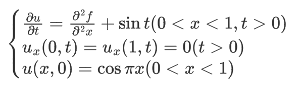
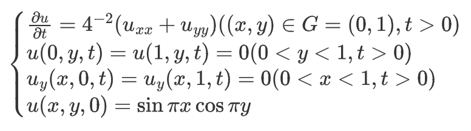

# Numerical-Methods-for-PDEs

[![Issues][issues-shield]][issues-url]
[![MIT License][license-shield]][license-url]
[![LinkedIn][linkedin-shield]][linkedin-url]

<!-- TABLE OF CONTENTS -->

## Table of Contents
  <ol>
    <li><a href="#about-the-project">About The Project</a></li>
    <li><a href="#license">License</a></li>
    <li><a href="#contact">Contact</a></li>
  </ol>

<!-- ABOUT THE PROJECT -->

## About The Project

This is a *course project* for Numerical Solution of Partial Differential Equations(NPDE), School of Mathematics and Statistics, Wuhan University. The instructor is Prof. Duan Huoyuan.

In this project, there are implementations of 6 numerical methods for 2 parabolic partial differential equations:

- For one-dimentional equations
  - Forward Finite Difference Scheme
  - Backward Finite Difference Scheme
  - Crank-Nicolson Scheme
- For two-dimensional equations
  - Alternating-Direction Implicit Scheme(ADI)
  - Predictor-Corrector Scheme
  - Locally One-Dimensional Scheme(LOD)

Note that the codes in this project compute the numerical solutions of these following 2 PDEs.
- One-dimentional equations

  
- Two-dimensional equations

  

After the numerical solution to each problem is given, the results of further analyses (including error distribution and estimated order of accuracy) are in [experiment report](experiment report.md).

<!-- LICENSE -->

## License

Distributed under the MIT License. See `LICENSE` for more information.

<!-- CONTACT -->
## Contact

Yueyin Tan - tanyueyin@outlook.com

<!-- ACKNOWLEDGEMENTS -->  

 

<!-- MARKDOWN LINKS & IMAGES -->
<!-- https://www.markdownguide.org/basic-syntax/#reference-style-links -->
[issues-shield]: https://img.shields.io/github/issues/tanyueyin0310/Numerical-Methods-for-PDEs.svg?style=for-the-badge
[issues-url]: https://github.com/tanyueyin0310/Numerical-Methods-for-PDEs/issues
[license-shield]: https://img.shields.io/github/license/tanyueyin0310/Numerical-Methods-for-PDEs.svg?style=for-the-badge
[license-url]: https://github.com/tanyueyin0310/Numerical-Methods-for-PDEs/blob/master/LICENSE
[linkedin-shield]: https://img.shields.io/badge/-LinkedIn-black.svg?style=for-the-badge&logo=linkedin&colorB=555
[linkedin-url]: https://linkedin.com/in/tanyueyin