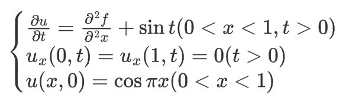
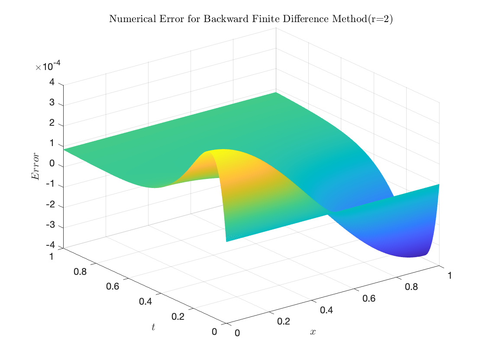
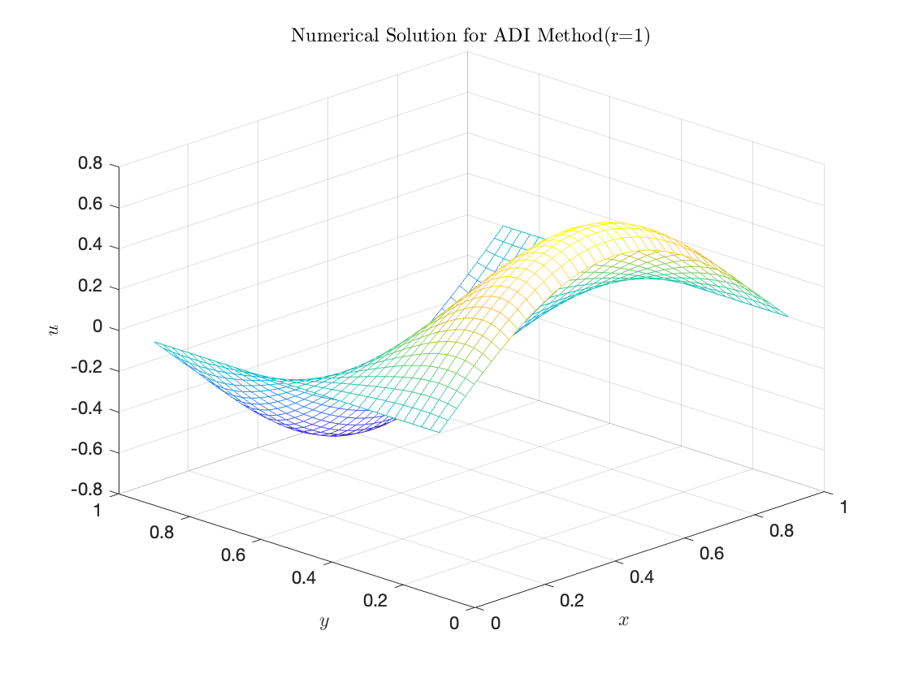

# Initial - boundary Value Problem of the 1D-PDE

## Problem

## Schemes

### Forward Finite Difference Scheme

#### Solution and Error Distribution

The *Forward Finite Difference Scheme* is a conditionally stable scheme, which is stable when r ≤ 1. As shown in the figure below, when r=2, the oscillation starts from t=0.0125.

The *Forward Finite Difference Scheme* is a is stable when r ≤ 1. The numerical solution and error distribution are shown below (r=0.5).

#### Order of Error Estimation

| h (step)                | 0.2        | 0.1         | 0.0625      | 0.025       |
| ----------------------- | ---------- | ----------- | ----------- | ----------- |
| Error (l-infinity norm) | 0.00055085 | 0.000126292 | 3.90424E-05 | 8.44037E-06 |

In l-infinity norm, the estimate order of error is 1.6424.

| h (step)         | 0.2         | 0.1         | 0.0625      | 0.025       |
| ---------------- | ----------- | ----------- | ----------- | ----------- |
| Error (l-2) | 0.001060421 | 0.000350459 | 0.000167984 | 4.10775E-05 |

In l-2 norm, the estimate order of error is 2.0293.

### Backward Finite Difference Scheme

#### Solution and Error Distribution

The *Backward Finite Difference Scheme* is an unconditionally stable scheme. The numerical solution and error distribution at r = 0.5 and r = 2 are shown in the figure below.

#### Order of Error Estimation

| h (step)                | 0.2         | 0.1         | 0.0625      | 0.025       |
| ----------------------- | ----------- | ----------- | ----------- | ----------- |
| Error (l-infinity norm) | 0.000583117 | 0.000160184 | 7.32735E-05 | 2.63344E-05 |

In l-infinity norm, the estimate order of error is 1.6413.

| h (step)         | 0.2         | 0.1         | 0.0625      | 0.025      |
| ---------------- | ----------- | ----------- | ----------- | ----------- |
| Error (l-2) | 0.001090576 | 0.000391929 | 0.000219282 | 0.00011986 |

In l-2 norm, the estimate order of error is 1.25.

### Crank-Nicolson Scheme

#### Solution and Error Distribution

The *Crank-Nicolson Scheme* is an unconditionally stable scheme. The  numerical solution and error distribution at r = 0.2 and r = 2 are shown in the figure below.

#### Order of Error Estimation

| h (step)                | 0.2         | 0.1         | 0.0625      | 0.025       |
| ----------------------- | ----------- | ----------- | ----------- | ----------- |
| Error (l-infinity norm) | 0.000566819 | 0.000143074 | 5.59946E-05 | 8.96384E-06 |

In l-infinity norm, the estimate order of error is 1.9753.

| h (step)    | 0.2         | 0.1         | 0.0625      | 0.025       |
| ----------- | ----------- | ----------- | ----------- | ----------- |
| Error (l-2) | 0.001060421 | 0.000350459 | 0.000167984 | 4.10775E-05 |

In l-2 norm, the estimate order of error is 1.5819.

# Initial - boundary Value Problem of the 2D-PDE

## Problem

## Schemes

### Alternating-Direction Implicit Scheme (ADI)

#### Solution and Error Distribution

The  numerical solution and error distribution at r = 1 are shown in the figure below.

#### Order of Error Estimation

| h (step)                | 0.25        | 0.2         | 0.125      | 0.1         |
| ----------------------- | ----------- | ----------- | ---------- | ----------- |
| Error (l-infinity norm) | 0.292302781 | 0.181662187 | 0.07686924 | 0.049860228 |

In l-infinity norm, the estimate order of error is 1.8638.

| h (step)    | 0.25        | 0.2         | 0.125       | 0.1         |
| ----------- | ----------- | ----------- | ----------- | ----------- |
| Error (l-2) | 0.339985339 | 0.181005693 | 0.046646037 | 0.024563412 |

In l-2 norm, the estimate order of error is 2.7361.

### Predictor-Corrector Scheme (PC)

#### Solution and Error Distribution

The  numerical solution and error distribution at r = 1 are shown in the figure below.

#### Order of Error Estimation

| h (step)                | 0.25        | 0.2        | 0.125       | 0.1         |
| ----------------------- | ----------- | ---------- | ----------- | ----------- |
| Error (l-infinity norm) | 0.287510319 | 0.17651619 | 0.070737568 | 0.043560584 |

In l-infinity norm, the estimate order of error is 1.9441.

| h (step)    | 0.25        | 0.2         | 0.125       | 0.1         |
| ----------- | ----------- | ----------- | ----------- | ----------- |
| Error (l-2) | 0.330706685 | 0.172345655 | 0.040378135 | 0.019554757 |

In l-2 norm, the estimate order of error is 2.8729.

### Locally One-Dimensional Scheme (LOD)

#### Solution and Error Distribution

The  numerical solution and error distribution at r = 1 are shown in the figure below.

#### Order of Error Estimation

| h (step)                | 0.25        | 0.2         | 0.125       | 0.1         |
| ----------------------- | ----------- | ----------- | ----------- | ----------- |
| Error (l-infinity norm) | 0.292306163 | 0.181666112 | 0.076869241 | 0.049860228 |

In l-infinity norm, the estimate order of error is 1.8638.

| h (step)    | 0.25        | 0.2        | 0.125       | 0.1         |
| ----------- | ----------- | ---------- | ----------- | ----------- |
| Error (l-2) | 0.341009183 | 0.18182284 | 0.046985255 | 0.024693888 |

In l-2 norm, the estimate order of error is 2.7322.

### Crank-Nicolson Scheme

#### Solution and Error Distribution

The  numerical solution and error distribution at r = 1 are shown in the figure below.

#### Order of Error Estimation

| h (step)                | 0.25        | 0.2         | 0.125       | 0.1         |
| ----------------------- | ----------- | ----------- | ----------- | ----------- |
| Error (l-infinity norm) | 0.292308176 | 0.181715896 | 0.076873537 | 0.049873923 |

In l-infinity norm, the estimate order of error is 1.8636.

| h (step)    | 0.25        | 0.2         | 0.125      | 0.1         |
| ----------- | ----------- | ----------- | ---------- | ----------- |
| Error (l-2) | 0.341780212 | 0.182539411 | 0.04728716 | 0.024888348 |

In l-2 norm, the estimate order of error is 2.7272.
